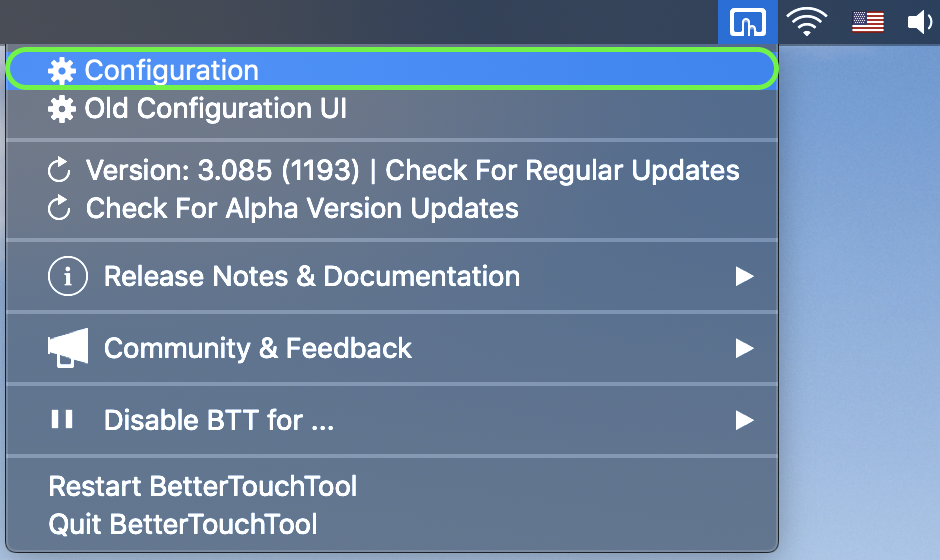
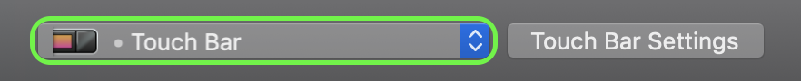
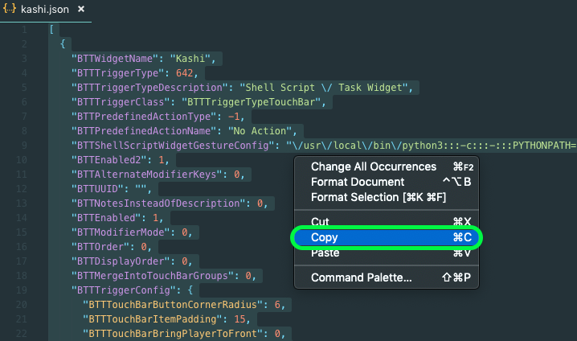
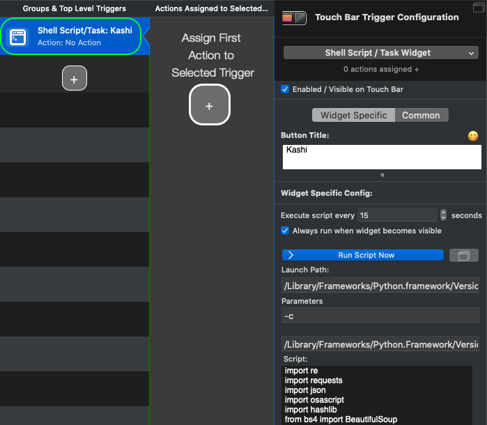

<h1 align="center">KASHI · 歌詞 · かし</h1>

   

Kashi is a custom widget for [BetterTouchTool](https://folivora.ai/) that displays the current song's lyrics on the Macbook Pro's Touch Bar. It works with [Spotify](https://www.spotify.com/us/download/other/) and [iTunes](https://www.apple.com/itunes/download/).

Kashi has three main functions:
1. It gets the current song playing via AppleScript.
2. It searches the [Genius API](https://docs.genius.com/) and looks for the best match within the hits.
3. It scrapes lyrics from the raw HTML, formats, and outputs them onto the Touch Bar.

## Installation

### Step 1: Install BetterTouchTool

Kashi was made for BetterTouchTool, so first you will need to download and install [BetterTouchTool](https://folivora.ai/). The software is free to use (for 45 days).

### Step 2: Install Python & Necessary Modules

Install [Python 3](https://www.python.org/downloads/release/python-371/) and the [PyPI](https://pypi.org/) modules below. 
To learn how to install a file from PyPI, visit the [installation tutorial](https://packaging.python.org/tutorials/installing-packages/#installing-from-pypi) on the Python Packaging User Guide.

  - [OSAscript](https://pypi.org/project/osascript/) 
  `pip install osascript` or `pip3 install osascript`
  - [Requests](https://pypi.org/project/requests/) 
  `pip install requests` or `pip3 install requests`
  - [BeautifulSoup](https://pypi.org/project/beautifulsoup4/) 
  `pip install beautifulsoup4` or `pip3 install beautifulsoup4`
  
### Step 3: Import Kashi Into BetterTouchTool

A. Open BetterTouchTool Configuration, accessible via the top menu bar.

B. Confirm that you are in the Touch Bar Settings.

C. Open [`kashi.json`](/kashi.json) in a text editor. Select all (⌘A) and copy (⌘C).

D. Return to the BetterTouchTool Configuration and paste (⌘V). You should see the new widget "Shell Script/Task: Kashi" in your list.

That's it! If you followed all the steps above, lyrics for the currently playing song should now appear on the Touch Bar. Enjoy! 🎉

For further Touch Bar customization, please visit the official [BetterTouchTool Documentation](https://docs.bettertouchtool.net/docs/402_touch_bar_basics.html)

## Planned Features
  - Support for Youtube Music
  - Scrolling lyrics
  - Support for non-English languages.

## Contact

[LinkedIn](https://www.linkedin.com/in/hojim)
